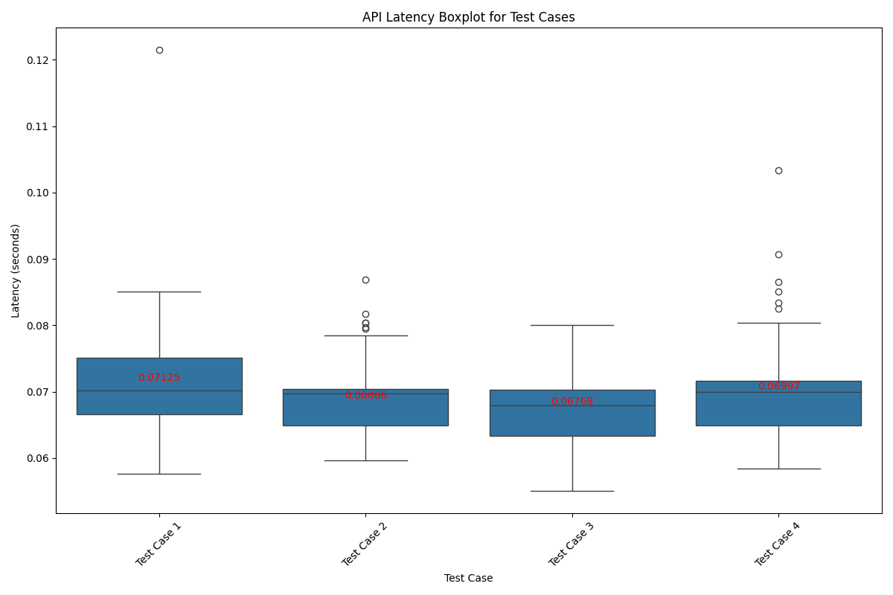

# ECE444-Lab5
> This is the repo for PRA5 activities for ECE444

# Activity 4 & 5: Creating App in AWS Elastic Beanstalk, locally on Flask, and Deployment on AWS
Link to my AWS Elastic Beanstalk server: http://ece444pra5-env.eba-qtc3myge.ca-central-1.elasticbeanstalk.com

### AWS Elastic Beanstalk server


### Local Flask App


# Activity 6.1: Functional/Unit testing
Impletend one test with 4 testcases (2 real news, 2 fake news)

On the terminal, run:
```sh
(venv)$ python -m pytest
```


# Activity 6.2: Latency/Performance testing
Generated CSV files for each test case, running 100 API calls. Generated a box plot and averages.
